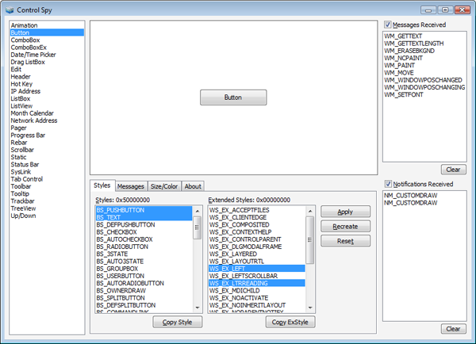
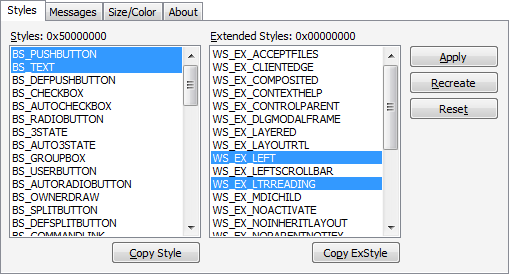
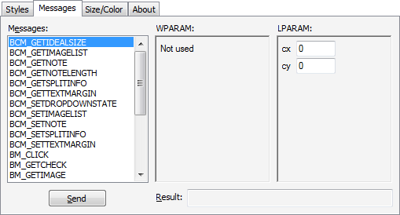

# Control Spy v2.0

Control Spy is a tool that helps developers understand common controls: how to apply styles to them, and how they respond to messages and notifications. Using Control Spy, you can immediately see how different styles affect the behavior and appearance of each control, and also how you can change the state of each control by sending messages.

Two versions of Control Spy are available, one for [Comctl32.dll version 5.x](common-control-versions.md) and one for Comctl32.dll version 6.0 and later. ControlSpyV6.exe has a built-in application manifest so that it uses the newer, themed controls. ControlSpyV5.exe does not have this manifest and so defaults to the older version.

This topic contains the following sections.

-   [Overview](#overview)
-   [Styles](#styles)
-   [Messages](#messages)
-   [Size/Color](#sizecolor)
-   [Where to Get Control Spy](#where-to-get-control-spy)
-   [Related topics](#related-topics)

## Overview

Control Spy hosts a selected common control in the center of its application window. You can change which control is shown by selecting different controls from the list box at the left side of the window. Messages or notifications received by the control will be listed at the right side of the window as they arrive. You can enable or disable this functionality by using the **Messages Received** and **Notifications Received** check boxes.

The following image shows the Control Spy application.

At the bottom of the window, there are several tabs that present more functionality.

## Styles

The **Styles** tab enables you to change the current window style of the control. Select or deselect any of the listed styles, then click the **Apply** button to change the style of the displayed control. Alternately, you can use the **Recreate** button to create a new control with the selected styles. The **Reset** button will return the control to the default styles.

The **Copy Style** and **Copy ExStyle** buttons below the tab will copy the selected style constants to the Clipboard as a bitwise OR (\|) delimited list. You can paste this list directly into your call to [**CreateWindowEx**](https://docs.microsoft.com/windows/desktop/api/winuser/nf-winuser-createwindowexa) to provide a control in your own application with the same style.

The following image shows the **Styles** tab for a button control.

## Messages

The **Messages** tab enables you to send almost any message to a control. After selecting a message from the list box, you can enter data which is sent as the *wParam* and *lParam* parameters of the call to [**SendMessage**](https://docs.microsoft.com/windows/desktop/api/winuser/nf-winuser-sendmessage). After you click **Send**, the message is sent to the control and any result is displayed in the text box at the bottom of the tab.

The following image shows the messages tab when a particular message is selected.

## Size/Color

The **Size/Color** tab can be used to change the size of the control as well as the color of its background.

## Where to Get Control Spy

You can download [Control Spy 2.0](https://www.microsoft.com/en-us/download/details.aspx?id=4635) from MSDN. Both versions are contained in the download.

## Related topics

<dl> <dt>

**Conceptual**
</dt> <dt>

[Windows Controls](window-controls.md)
</dt> <dt>

[Enabling Visual Styles](cookbook-overview.md)
</dt> </dl>

 

 

