# Installing and Using Input Method Editors

This article offers a tutorial for how to install and use the standard Windows Input Method Editor (IME).

-   [Installing an Input Method Editor](#installing-an-input-method-editor)
-   [Simplified Chinese IME](#simplified-chinese-ime)
-   [Traditional Chinese IME](#traditional-chinese-ime)
-   [Japanese IME](#japanese-ime)
-   [Korean IME](#korean-ime)
-   [Requirements](#requirements)

## Installing an Input Method Editor

The following sections describe how to install and use Input Method Editors (IMEs) to enter complex characters in four different East Asian languages. Features unique to each language are discussed.

To implement Input Method Editor (IME) functionality in an application, see [Using an Input Method Editor in a Game](/windows/desktop/DxTechArts/using-an-input-method-editor-in-a-game).

An IME is not installed on Microsoft Windows XP systems by default. To install, complete the following steps.

**To install an IME**

1.  From the Control Panel, open Regional and Language Options.
2.  On the Languages tab, select the Install files for East Asian languages checkbox.

    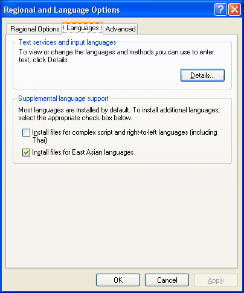

    An Install Supplemental Language Support dialog box appears informing you of the storage requirements for the language files.

    

3.  Click OK to close the dialog box.
4.  Click OK on the Languages tab.
5.  Another dialog box appears requesting a Windows XP installation disk or network share location where the language support files are located. Insert a Windows XP compact disk or browse to the appropriate network location, and click OK. Microsoft Windows installs the necessary files and prompts for you to restart the computer.
6.  Click Yes to restart the computer.
7.  After restarting, open the Regional and Language Options control panel once again.
8.  On the Languages tab, click Details. The Text Services and Input Languages window appears.

    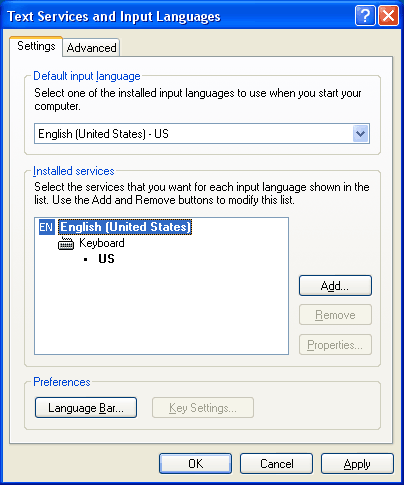

9.  On the Settings tab, click Add. The Add Input Language window appears.

    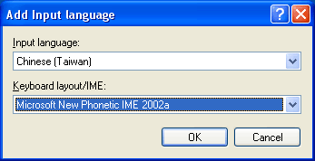

10. Select Chinese (Taiwan) for input language and Microsoft New Phonetic IME 2002a for keyboard layout/IME.
11. Click OK. Now you can add additional languages and IMEs in a similar fashion.
12. Click Add again, select Chinese (PRC) for input language and Chinese (Simplified) - Microsoft Pinyin IME 3.0 for keyboard layout/IME, then click OK.
13. Click Add again, select Japanese for input language and Microsoft IME Standard 2002 ver. 8.1 for keyboard layout/IME, then click OK.
14. Click Add again, select Korean for input language and Korean Input System (IME 2002) for keyboard layout/IME, then click OK. In the Text Services and Input Languages window, the Installed services list box should now contain the four newly-added IMEs.

    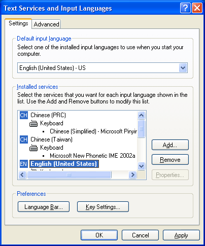

15. Click OK to close the Text Services and Input Languages window.
16. Click OK to close the Regional and Language Options control panel. The Windows taskbar should now contain an input locale indicator circled in red. The existence of the indicator signifies that more than one input language has been installed on the system.

    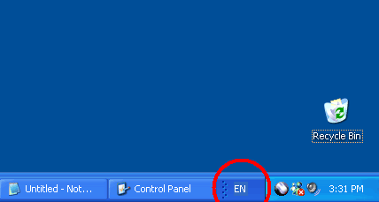

## Simplified Chinese IME

This section describes how to use the Simplified Chinese IME (PinYin) with Microsoft Notepad to enter a few Chinese characters.

1.  Launch Notepad (available from the Start button, then select All Programs and Accessories). Type some characters in Notepad. These characters will help you visualize the IME window better later.

    

2.  With Notepad as the active application, click the input locale indicator and select Chinese (PRC). The indicator display changes to CH to reflect that the new input language is Chinese (PRC).

    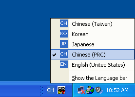

3.  Place the cursor in Notepad. Press HOME on the keyboard so that the cursor is at the beginning of the line. On the keyboard type "N", then "I". The following figure shows the appearance of the display. The small horizontal rectangle is the reading window, which displays the current reading string. Currently, the reading string is "ni" as a result of typing "N" and "I".

    

4.  Type "3". Now Notepad has the following display. Because N+I+3 is a complete pronunciation in Simplified Chinese Pinyin, the IME has enough information to anticipate the character that the user may have intended to enter. The reading window disappears because you have entered a complete pronunciation. A character is displayed on top of the Notepad cursor. This character is not part of Notepad, rather it is displayed in another window on top of Notepad and hides the existing characters in Notepad that are beneath. This new window is called the composition window, and the string in it is called the composition string. The composition string is underlined in the display.

    

5.  Now type "H", "A", "O", "3" to enter another character. Note that the reading window shows up when "H" is typed and disappears when "3" is typed. As shown below, the composition string now contains two characters.

    

6.  Press the left arrow on the keyboard once. The composition cursor moves one character to the left, at the second character you typed. A window appears on top of Notepad as shown below. This window is called the candidate window. It displays a list of characters or phrases that match the pronunciation that you have typed. You can select the intended word from the entries in the candidate list. In this example, two candidate characters are available with the same pronunciation.

    

7.  Type "2" to select the second entry. The candidate window now closes, and the composition string is updated with the selected character.

    

8.  Press ENTER. This tells the IME that the composition is complete and the string should be sent to the application - Notepad in this example. The composition window closes, and the two characters are sent to Notepad via WM\_CHAR. The underline is gone in the following figure because the two characters shown are part of the text in Notepad. The existing text "ABCDEFG" in Notepad is moved to the right because two more characters have been inserted. You have now successfully entered two Simplified Chinese characters using an IME.

    

## Traditional Chinese IME

This section describes how to use the Traditional Chinese IME (New Phonetic) with Notepad to enter a few Chinese characters.

1.  Launch Notepad. Type some characters in Notepad. These characters will help you visualize the IME window better later.

    

2.  Click the input locale indicator on the Windows taskbar, and select Chinese (Taiwan). The indicator display changes to CH to reflect that the new input language is Chinese (Taiwan).

    

3.  Place the cursor in Notepad. Press HOME on the keyboard so that the cursor is at the beginning of the line. On the keyboard type "S", then "U". The following figure shows the appearance of the display. The small vertical rectangle is the reading window, which displays the current reading string. As shown in the following figure, the reading string has two characters as a result of typing "S" and "U".

    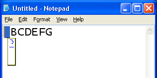

4.  Type "3". Now Notepad has the following display. Because S+U+3 is a complete pronunciation in Traditional Chinese, the IME has enough information to anticipate the character that the user may have intended to enter. The reading window disappears because you have entered a complete pronunciation. A character is displayed on top of the Notepad cursor. This character is not part of Notepad, rather it is displayed in another window on top of Notepad and hides the existing characters in Notepad that are beneath. This new window is called the composition window, and the string in it is called the composition string. The composition string is underlined in the display.

    

5.  Now type "C", "L", and "3" to enter another character. Note that the reading window shows up when "C" is typed and disappears when "3" is typed. As shown below, the composition string now contains two characters.

    

6.  Type the down arrow on the keyboard once. A window appears on top of Notepad as shown below. This window is called the candidate window. It displays a list of characters or phrases that match the pronunciation that you have typed. You can select the intended word from the entries in the candidate list. In this example, three candidate characters are available with the same pronunciation.

    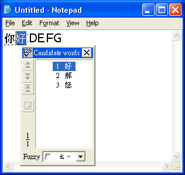

7.  Type "2" to select the second entry. The candidate window now closes, and the composition string is updated with the selected character.

    

8.  Press ENTER. This tells the IME that the composition is complete and the string should be sent to the application - Notepad in this example. The composition window closes, and the two characters are sent to Notepad via [**WM\_CHAR**](/windows/desktop/inputdev/wm-char). The underline is gone in the following figure because the two characters shown are part of the text in Notepad. The existing text "ABCDEFG" in Notepad is moved to the right because two more characters have been inserted. You have now successfully entered two Traditional Chinese characters using an IME.

    

## Japanese IME

This section is a walk-through of using the Japanese IME with Notepad to enter a few Japanese characters.

1.  Launch Notepad. Type some characters in Notepad. These characters will help you visualize the IME window better later.

    

2.  With Notepad as the active application, click the input locale indicator, and select Japanese. The indicator display changes to JP to reflect that the new input language is Japanese.

    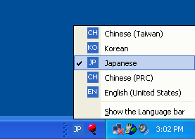

3.  Place the cursor in Notepad. Press HOME on the keyboard so that the cursor is at the beginning of the line. On the keyboard type "N", then "I". The following figure shows the appearance of the display. Because N+I is a complete pronunciation in Japanese, the IME has enough information to anticipate the character that the user may have intended to enter. A character is displayed on top of the Notepad cursor. This character is not part of Notepad, rather it is displayed in another window on top of Notepad and hides the existing characters in Notepad that are beneath. This new window is called the composition window, and the string in it is called the composition string. The composition string is underlined in the display.

    

4.  Now type "H", "O", "N", "G", and "O" to enter two more characters. The composition string now contains four characters, as shown below.

    

5.  Press the Space Bar. This instructs the IME to convert the entered text into clauses. In the figure below, the IME converts the pronunciation "Nihongo" to a clause written in Kanji that means "Japanese Language."

    

6.  Press the down arrow on the keyboard once. A window appears on top of Notepad as shown below. This window is called the candidate window. It displays a list of clauses that match the pronunciation that you have typed. You can select the intended word from the list of candidates. In this example, three candidate characters are available with the same pronunciation. Note that the second entry is highlighted, and the composition string changes. This is caused by typing the down arrow, which tells the IME to select the entry after the one that was previously displayed.

    

7.  Type "2" to select the second entry. The candidate window now closes, and the composition string is updated with the selected character.

    

8.  Press ENTER. This tells the IME that the composition is complete and the string should be sent to the application - Notepad in this example. The composition window closes, and the two characters are sent to Notepad via [**WM\_CHAR**](/windows/desktop/inputdev/wm-char). The underline is gone in the following figure because the two characters shown are part of the text in Notepad. The existing text "ABCDEFG" in Notepad is moved to the right because two more characters have been inserted. You have now successfully entered a few Japanese characters using an IME.

    

## Korean IME

This section describes how to use the Korean IME with Notepad to enter a few Korean characters.

1.  Launch Notepad. Type some characters in Notepad. These characters will help you visualize the IME window better later.

    

2.  With Notepad as the active application, click the input locale indicator, and select Korean. The indicator display changes to KO to reflect that the new input language is Korean.

    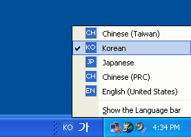

3.  Place the cursor in Notepad. Press HOME on the keyboard so that the cursor is at the beginning of the line, then type "G". The following figure shows the appearance of the display. The phonetic element corresponding to "G" appears on Notepad and is highlighted with a block cursor. This highlighted character is called the composition string. Note that unlike the IME for other languages, the composition string is sent to Notepad and inserted to the left of the existing text as soon as the user enters a single phonetic element.

    

4.  At this time, the composition string consists of an interim character because any additional phonetic elements entered by the user change the composition string in place. Now type "K", then "S". Note that the interim character changes with each keystroke.

    

5.  Now press the right CTRL key. A candidate window appears that lists the Hanja characters you can select for the pronunciation entered, G+K+S.

    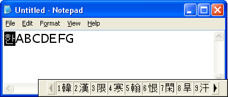

6.  Type the numeral "1" to select the first entry in the list. The candidate window closes, and the composition string is updated with the character selected.

    

7.  Type "R", "N", and "R". Then press the right CTRL key to enter another character.

    

8.  Type "1" to select the first entry. You have now successfully entered two Korean characters using an IME. The Korean characters are already part of the text string in Notepad.

    

## Requirements

|                                     |                                                                                                            |
|-------------------------------------|------------------------------------------------------------------------------------------------------------|
| **Operating System**                | Windows XP                                                                                                 |
| **Available Hard Disk Space**       | At least 230 MB                                                                                            |
| **Foreign Language File Locations** | Windows XP installation compact disk or network location with Windows XP installation files                |
| **Time**                            | About ten minutes to install foreign language files; about ten minutes each to review four different IMEs. |

 

 

 