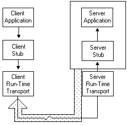

# Exception Handling

RPC uses the same approach to exception handling as the Windows API.

The [**RpcTryFinally**](rpctryfinally.md) / [**RpcFinally**](https://msdn.microsoft.com/library/Aa375699(v=VS.80).aspx) / [**RpcEndFinally**](https://msdn.microsoft.com/library/Aa375634(v=VS.80).aspx) structure is equivalent to the Windows **try-finally** statement. The RPC exception construct [**RpcTryExcept**](rpctryexcept.md) / [**RpcExcept**](/windows/desktop/api/Rpc/nf-rpc-rpcexcept) / [**RpcEndExcept**](https://msdn.microsoft.com/library/Aa375629(v=VS.80).aspx) is equivalent to the Windows **try-except** statement.

When you use the RPC exception handlers, your client-side source code is portable. The different RPC header files provided for each platform resolve the **RpcTry** and [**RpcExcept**](/windows/desktop/api/Rpc/nf-rpc-rpcexcept) macros for each platform. In the Windows environment, these macros map directly to the Windows **try-finally** and **try-except** statements. In other environments, these macros map to other platform-specific implementations of exception handlers.

Potential exceptions raised by these structures include the set of error codes returned by the RPC functions with the prefixes RPC\_S\_ and RPC\_X and the set of exceptions returned by Windows. For details, see [RPC Return Values](rpc-return-values.md).

While the **RpcTry** and [**RpcExcept**](/windows/desktop/api/Rpc/nf-rpc-rpcexcept) macros provide a customizable platform-agnostic way to handle exceptions, in Windows Vista and later versions of Windows, [**RpcExceptionFilter**](/windows/desktop/api/Rpcdce/nf-rpcdce-rpcexceptionfilter) is the recommended way of handling exceptions. It does not require custom filters to be written to capture many of the most common structured exceptions; however, custom exception filters still require **RpcExcept**.

Exceptions that occur in the server application, server stub, and server run-time library (above the transport layer) are propagated to the client. No exceptions are propagated from the server-transport level. The recommended method for a server routine to return errors to the RPC run time is to throw an exception. A server routine can use whatever methods is appropriate for communicating errors between server routines, but if it encounters an error that prevents it from executing the remote procedure, it should raise an exception after cleaning up and before returning to the RPC run time, rather than returning a value to RPC that only the server routine recognizes as an error.

The following figure shows how exceptions are returned from the server to the client.

The RPC exception handlers differ slightly from the Open Software Foundation-Distributed Computing Environment (OSF-DCE) exception-handling macros **TRY**, **FINALLY**, and **CATCH**. Various vendors provide include files that map the OSF-DCE RPC functions to the Microsoft RPC functions, including **TRY**, **CATCH**, **CATCH**\_**ALL**, and **ENDTRY**. These header files also map the RPC\_S\_\* error codes onto the OSF-DCE exception counterparts, rpc\_s\_\*, and map RPC\_X\_\* error codes to rpc\_x\_\*. For OSF-DCE portability, use these include files. For more information about the RPC exception handlers, see [**RpcExceptionFilter**](/windows/desktop/api/Rpcdce/nf-rpcdce-rpcexceptionfilter), [**RpcExcept**](/windows/desktop/api/Rpc/nf-rpc-rpcexcept), [**RpcFinally**](https://msdn.microsoft.com/library/Aa375699(v=VS.80).aspx). For more information about the Windows exception handlers, see [Structured Exception Handling](https://docs.microsoft.com/windows/desktop/Debug/structured-exception-handling).

 

 

