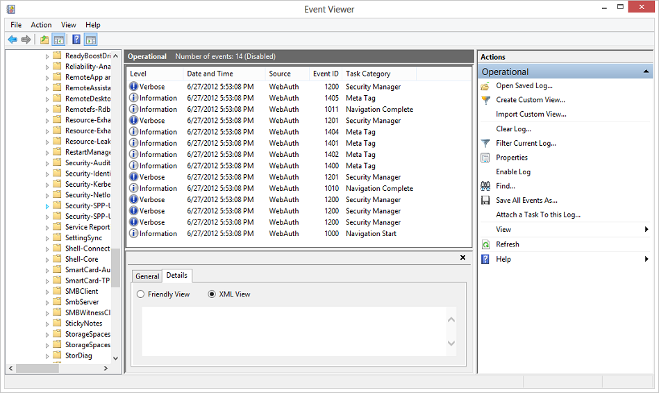

# Web authentication problems

This topic describes troubleshooting tips for using the Web Authentication Broker APIs for your web pages.

-   [Operational logs](#operational-logs)
-   [Using Fiddler with Web Authentication Broker](#using-fiddler-with-web-authentication-broker)
-   [Related topics](#related-topics)

## Operational logs

Often you can determine what is not working by using the operational logs. There is a dedicated event log channel Microsoft-Windows-WebAuth\\Operational that allows website developers to understand how their web pages are being processed by the Web Authentication Broker. To enable it, launch eventvwr.exe and enable Operational log under the Application and Services\\Microsoft\\Windows\\WebAuth. Also, the Web Authentication Broker appends a unique string to the user agent string to identify itself on the web server. The string is "MSAuthHost/1.0". Note that the version number may change in the future, so you should not to depend on that version number in your code. An example of the full user agent string is as follows:

`User-Agent: Mozilla/5.0 (compatible; MSIE 10.0; Windows NT 6.2; Win64; x64; Trident/6.0; MSAuthHost/1.0)`

Example of using operational logs

1.  Enable operational logs
2.  Run Contoso social application
3.  The generated logs entries can be used to understand the behavior of Web Authentication Broker in greater detail. In this case, these can include:
    -   Navigation Start: Logs when the AuthHost is started and contains information about the start and termination URLs.
    -   
    -   Navigation Complete: Logs the completion of loading a web page.
    -   Meta Tag: Logs when a meta-tag is encountered including the details.
    -   Navigation Terminate: Navigation terminated by the user.
    -   Navigation Error: AuthHost encounters a navigation error at a URL including HttpStatusCode.
    -   Navigation End: Terminating URL is encountered.

## Using Fiddler with Web Authentication Broker

The Fiddler web debugger can be used with Windows 8 apps.

1.  Since the AuthHost runs in its own app container to give it the private network capability, you must set a registry key: Windows Registry Editor Version 5.00

    **HKEY\_LOCAL\_MACHINE**\\**SOFTWARE**\\**Microsoft**\\**Windows NT**\\**CurrentVersion**\\**Image File Execution Options**\\**authhost.exe**\\**EnablePrivateNetwork** = 00000001<dl> <dt>

                     Data type
</dt> <dd>                     DWORD</dd> </dl>

2.  Add a rule for the AuthHost as this is what is generating the outbound traffic.
    ```cmd
    CheckNetIsolation.exe LoopbackExempt -a -n=microsoft.windows.authhost.a.p_8wekyb3d8bbwe
    CheckNetIsolation.exe LoopbackExempt -a -n=microsoft.windows.authhost.sso.p_8wekyb3d8bbwe
    CheckNetIsolation.exe LoopbackExempt -a -n=microsoft.windows.authhost.sso.c_8wekyb3d8bbwe
    D:\Windows\System32>CheckNetIsolation.exe LoopbackExempt -s
    List Loopback Exempted AppContainers
    [1] -----------------------------------------------------------------
        Name: microsoft.windows.authhost.sso.c_8wekyb3d8bbwe
        SID:  S-1-15-2-1973105767-3975693666-32999980-3747492175-1074076486-3102532000-500629349
    [2] -----------------------------------------------------------------
        Name: microsoft.windows.authhost.sso.p_8wekyb3d8bbwe
        SID:  S-1-15-2-166260-4150837609-3669066492-3071230600-3743290616-3683681078-2492089544
    [3] -----------------------------------------------------------------
        Name: microsoft.windows.authhost.a.p_8wekyb3d8bbwe
        SID:  S-1-15-2-3506084497-1208594716-3384433646-2514033508-1838198150-1980605558-3480344935
    ```

    

3.  Add a firewall rule for incoming traffic to Fiddler.

For more information, see [Blog on using Fiddler web debugger with Windows Store apps](/archive/blogs/fiddler/revisiting-fiddler-and-win8-immersive-applications).

## Related topics

<dl> <dt>

[Considerations for the web page development](considerations-for-the-web-page-development.md)
</dt> <dt>

[FAQ for Web Authentication Broker](faq-for-web-authentication-broker.md)
</dt> <dt>

[Web Authentication Broker SDK sample app](https://github.com/microsoft/Windows-universal-samples/tree/master/Samples/WebAuthenticationBroker)
</dt> <dt>

[**Windows.Security.Authentication.Web**](/uwp/api/Windows.Security.Authentication.Web?view=winrt-19041)
</dt> </dl>

 

 
