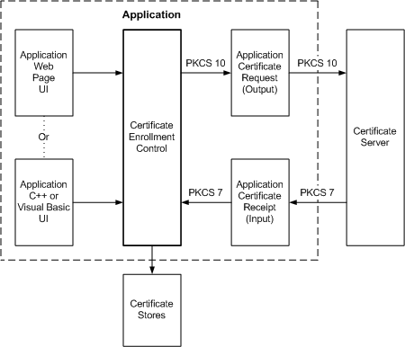

# Certificate Enrollment Control

Certificate Enrollment Control can be used by an application that must request that a certificate be issued to a named subject. It is designed to accept data in the form of a binary string (BSTR). The data can come from a webpage or from the user interface of the Visual Basic or Visual C++ development system. The output from the Certificate Enrollment Control is a PKCS \#10 certificate request that can be sent on to a [*certification authority*](https://msdn.microsoft.com/library/ms721572(v=VS.85).aspx) (CA).

Necessary information about the user, the certificate subject, is collected by the User Interface. This information is provided as a BSTR input to the Certificate Enrollment Control. The Certificate Enrollment Control generates the appropriate signature key, key exchange key, or both key pairs. The control then generates and signs a PKCS \#10 [*certificate request*](https://msdn.microsoft.com/library/ms721572(v=VS.85).aspx) by using the generated [*private key*](https://msdn.microsoft.com/library/ms721603(v=VS.85).aspx). The Certificate Enrollment Control then links the key pair to a temporary dummy certificate which is stored in the request store until the issued certificate is returned from a certification authority. Finally, the application sends the PKCS \#10 certificate request to a CA.

If the CA approves the certificate request, the CA creates a certificate containing the public key. The CA also signs and returns the certificate.

When the requested certificate is returned from the CA, the application passes the PKCS \#7 message back to the Certificate Enrollment Control where the certificate or chain of certificates is extracted from the PKCS \#7 message. The certificate and any other certificates in the chain of trust are stored in a [*certificate store*](https://msdn.microsoft.com/library/ms721572(v=VS.85).aspx). The returned certificate is not modified in any way. Any certificate-aware application can now access this certificate from the store.

Smart Card Enrollment Control is used by an administrator to enroll on behalf of smart card users. The enrollment process results in a certificate being issued that is stored on a user's smart card.

The Smart Card Enrollment Control is contained in Scrdenrl.dll and consists of one object, **SCrdEnr**. No other objects are included in Scrdenrl.dll. This Smart Card Enrollment object can be used with a script language, such as Visual Basic Scripting Edition (VBScript).

A [*smart card reader*](https://msdn.microsoft.com/library/ms721604(v=VS.85).aspx) must be installed on the computer running the Smart Card Enrollment Control.

Additionally, the smart card issuer must have obtained a signing certificate based on the "EnrollmentAgent" certificate template. This signing certificate will be used to sign the certificate request generated on behalf of the smart card recipient. By default, domain administrators are granted permission to request a certificate based on the "Enrollment Agent" template. Another user can be granted permission to enroll for an "EnrollmentAgent" certificate (by means of the Active Directory Sites and Services MMC snap-in); doing so, however, allows this user to self-issue a smart card with domain administrator privileges.

 

 

