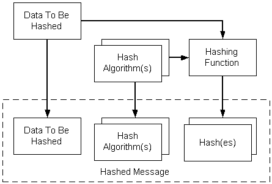

# Encoding and Decoding a Hashed Message

Hashed data consists of content of any type and a [*hash*](https://msdn.microsoft.com/library/ms721586(v=VS.85).aspx) of the content. It can be used when it is only necessary to confirm that the message content has not been modified since the hash was created.

When creating a hashed message, there can be multiple hash algorithms and multiple hashes. The following illustration depicts the tasks required to encode a hashed message. The procedure is described in the text that follows the illustration.

**To create a hashed message**

1.  Get a pointer to the data to be hashed.
2.  Select the hash algorithm to be used.
3.  Put the data through a hashing function using the hash algorithm.
4.  Include the original data to be hashed, the hashing algorithms, and the hashes in the encoded message.

To use low-level message functions to accomplish the tasks just outlined, use the following procedure.

**To hash and encode a message using low-level message functions**

1.  Create or retrieve the content to be hashed.
2.  Get a cryptographic provider.
3.  Initialize the [**CMSG\_HASHED\_ENCODE\_INFO**](/windows/desktop/api/Wincrypt/ns-wincrypt-cmsg_hashed_encode_info) structure.
4.  Call [**CryptMsgCalculateEncodedLength**](/windows/desktop/api/Wincrypt/nf-wincrypt-cryptmsgcalculateencodedlength) to get the size of the encoded message BLOB. Allocate memory for it.
5.  Call [**CryptMsgOpenToEncode**](/windows/desktop/api/Wincrypt/nf-wincrypt-cryptmsgopentoencode), passing in CMSG\_HASHED for the *dwMsgType* parameter and a pointer to [**CMSG\_HASHED\_ENCODE\_INFO**](/windows/desktop/api/Wincrypt/ns-wincrypt-cmsg_hashed_encode_info) for the *pvMsgEncodeInfo* parameter. As a result of this call, you get a handle to the opened message.
6.  Call [**CryptMsgUpdate**](/windows/desktop/api/Wincrypt/nf-wincrypt-cryptmsgupdate), passing in the handle retrieved in step 5 and a pointer to the data that is to be hashed and encoded. This function can be called as many times as necessary to complete the encoding process.
7.  Call [**CryptMsgGetParam**](/windows/desktop/api/Wincrypt/nf-wincrypt-cryptmsggetparam), passing in the handle retrieved in step 5 and the appropriate parameter types to access the desired, encoded data. For example, pass in CMSG\_CONTENT\_PARAM to get a pointer to the entire [*PKCS \#7*](https://msdn.microsoft.com/library/ms721603(v=VS.85).aspx) message.

    If the result of this encoding is to be used as the [*inner data*](https://msdn.microsoft.com/library/ms721588(v=VS.85).aspx) for another encoded message, such as an enveloped message, CMSG\_BARE\_CONTENT\_PARAM must be passed. For an example showing this, see [Alternate Code for Encoding an Enveloped Message](alternate-code-for-encoding-an-enveloped-message.md).

8.  Close the message by calling [**CryptMsgClose**](/windows/desktop/api/Wincrypt/nf-wincrypt-cryptmsgclose).

The result of this procedure is an encoded message that contains the original data, the hashing algorithms, and the [*hash*](https://msdn.microsoft.com/library/ms721586(v=VS.85).aspx) of that data. A pointer to the encoded message [*BLOB*](https://msdn.microsoft.com/library/ms721569(v=VS.85).aspx) is obtained in step 7.

The following two procedures decode and then verify hashed data.

**To decode hashed data**

1.  Get a pointer to the encoded BLOB.
2.  Call [**CryptMsgOpenToDecode**](/windows/desktop/api/Wincrypt/nf-wincrypt-cryptmsgopentodecode), passing the necessary arguments.
3.  Call [**CryptMsgUpdate**](/windows/desktop/api/Wincrypt/nf-wincrypt-cryptmsgupdate) once, passing in the handle retrieved in step 2 and a pointer to the data that is to be decoded. This causes the appropriate actions to be taken on the message, depending on the message type.
4.  Call [**CryptMsgGetParam**](/windows/desktop/api/Wincrypt/nf-wincrypt-cryptmsggetparam), passing in the handle retrieved in step 2, and the appropriate parameter types to access the desired, decoded data. For example, pass in CMSG\_CONTENT\_PARAM to get a pointer to the decoded content.

**To verify the hash**

1.  Call [**CryptMsgControl**](/windows/desktop/api/Wincrypt/nf-wincrypt-cryptmsgcontrol), passing in CMSG\_CTRL\_VERIFY\_HASH to verify the hashes.
2.  Call [**CryptMsgClose**](/windows/desktop/api/Wincrypt/nf-wincrypt-cryptmsgclose) to close the message.

For an example program, see [Example C Program: Encoding and Decoding a Hashed Message](example-c-program-encoding-and-decoding-a-hashed-message.md).

 

 

