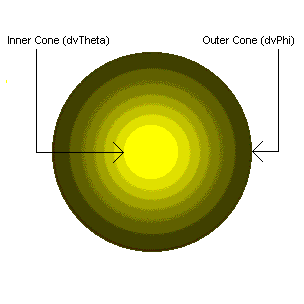
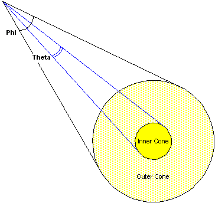
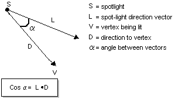
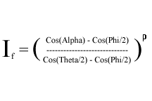
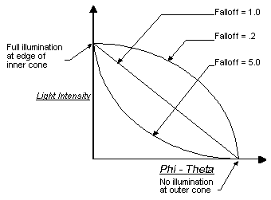

# Light Types (Direct3D 9)

The light type property defines which type of light source you're using. The light type is set by using a value from the [**D3DLIGHTTYPE**](https://msdn.microsoft.com/library/Bb172567(v=VS.85).aspx) C++ enumeration in the Type member of the light's [**D3DLIGHT9**](d3dlight9.md) structure. There are three types of lights in Direct3D - point lights, spotlights, and directional lights. Each type illuminates objects in a scene differently, with varying levels of computational overhead.

## Point Light

Point lights have color and position within a scene, but no single direction. They give off light equally in all directions, as shown in the following illustration.

A light bulb is a good example of a point light. Point lights are affected by attenuation and range, and illuminate a mesh on a vertex-by-vertex basis. During lighting, Direct3D uses the point light's position in world space and the coordinates of the vertex being lit to derive a vector for the direction of the light, and the distance that the light has traveled. Both are used, along with the vertex normal, to calculate the contribution of the light to the illumination of the surface.

## Directional Light

Directional lights have only color and direction, not position. They emit parallel light. This means that all light generated by directional lights travels through a scene in the same direction. Imagine a directional light as a light source at near infinite distance, such as the sun. Directional lights are not affected by attenuation or range, so the direction and color you specify are the only factors considered when Direct3D calculates vertex colors. Because of the small number of illumination factors, these are the least computationally intensive lights to use.

## SpotLight

Spotlights have color, position, and direction in which they emit light. Light emitted from a spotlight is made up of a bright inner cone and a larger outer cone, with the light intensity diminishing between the two, as shown in the following illustration.

Spotlights are affected by falloff, attenuation, and range. These factors, as well as the distance light travels to each vertex, are figured in when computing lighting effects for objects in a scene. Computing these effects for each vertex makes spotlights the most computationally time-consuming of all lights in Direct3D.

The [**D3DLIGHT9**](d3dlight9.md) C++ structure contains three members that are used only by spotlights. These members - Falloff, Theta, and Phi - control how large or small a spotlight object's inner and outer cones are, and how light decreases between them.

The Theta value is the radian angle of the spotlight's inner cone, and the Phi value is the angle for the outer cone of light. The Falloff value controls how light intensity decreases between the outer edge of the inner cone and the inner edge of the outer cone. Most applications set Falloff to 1.0 to create falloff that occurs evenly between the two cones, but you can set other values as needed.

The following illustration shows the relationship between the values for these members and how they can affect a spotlight's inner and outer cones of light.

Spotlights emit a cone of light that has two parts: a bright inner cone and an outer cone. Light is brightest in the inner cone and isn't present outside the outer cone, with light intensity attenuating between the two areas. This type of attenuation is commonly referred to as falloff.

The amount of light a vertex receives is based on the vertex's location in the inner or outer cones. Direct3D computes the dot product of the spotlight's direction vector (L) and the vector from the light to the vertex (D). This value is equal to the cosine of the angle between the two vectors, and serves as an indicator of the vertex's position that can be compared to the light's cone angles to determine where the vertex might lie in the inner or outer cones. The following illustration provides a graphical representation of the association between these two vectors.

The system compares this value to the cosine of the spotlight's inner and outer cone angles. In the light's [**D3DLIGHT9**](d3dlight9.md) structure, the Theta and Phi members represent the total cone angles for the inner and outer cones. Because the attenuation occurs as the vertex becomes more distant from the center of illumination (rather than across the total cone angle), the runtime divides these cone angles in half before calculating their cosines.

If the dot product of vectors L and D is less than or equal to the cosine of the outer cone angle, the vertex lies beyond the outer cone and receives no light. If the dot product of L and D is greater than the cosine of the inner cone angle, then the vertex is within the inner cone and receives the maximum amount of light, still considering attenuation over distance. If the vertex is somewhere between the two regions, then falloff is calculated with the following equation.

Where:

-   I f is light intensity after falloff
-   Alpha is the angle between vectors L and D
-   Theta is the inner cone angle
-   Phi is the outer cone angle
-   p is the falloff

This formula generates a value between 0.0 and 1.0 that scales the light's intensity at the vertex to account for falloff. Attenuation as a factor of the vertex's distance from the light is also applied. The following graph shows how different falloff values can affect the falloff curve.

The effect of various falloff values on the actual lighting is subtle, and a small performance penalty is incurred by shaping the falloff curve with falloff values other than 1.0. For these reasons, this value is typically set to 1.0.

## Related topics

<dl> <dt>

[Lights and Materials](lights-and-materials.md)
</dt> </dl>

 

 

