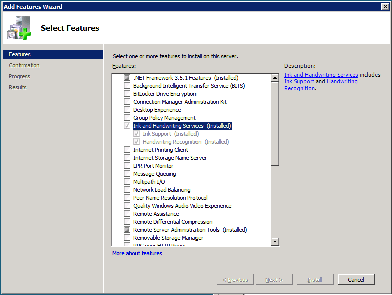
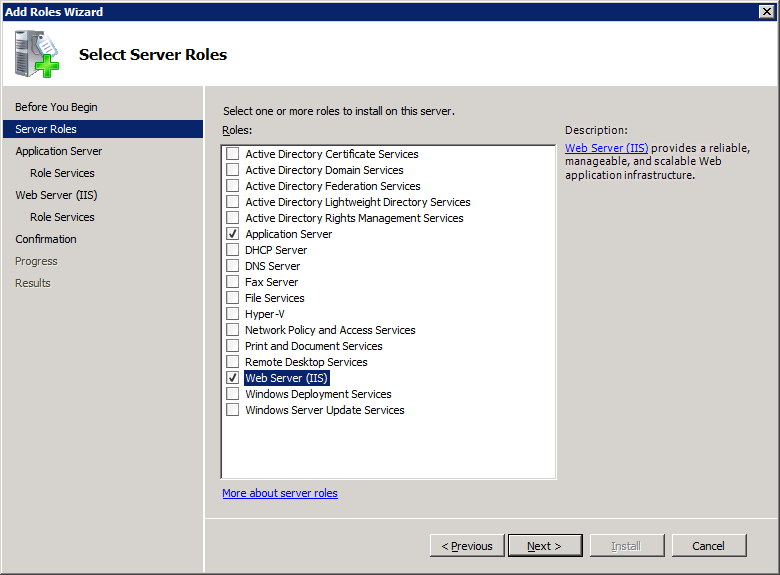
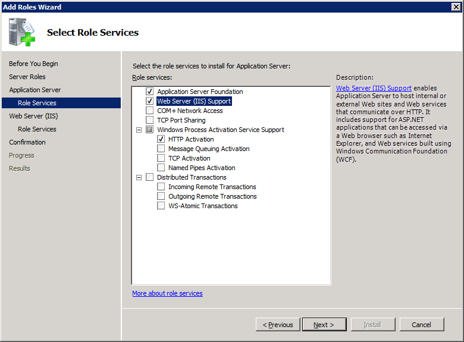
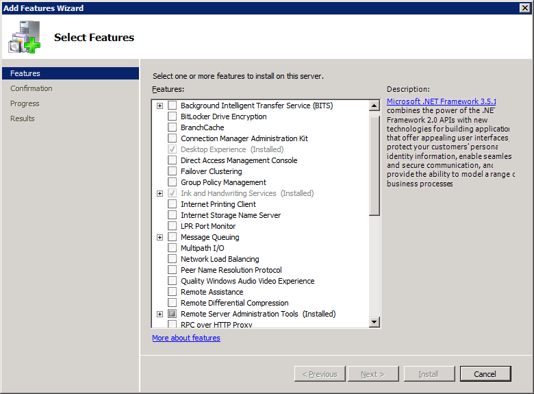
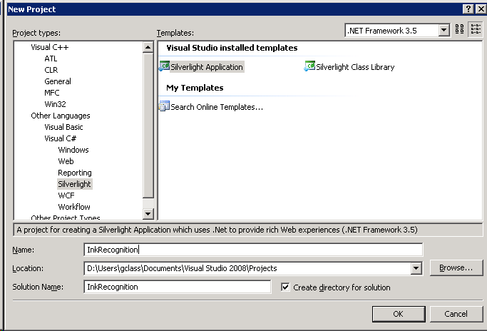
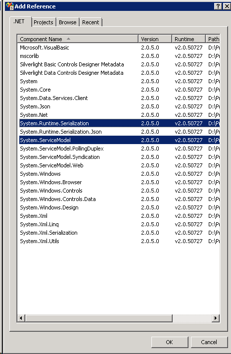
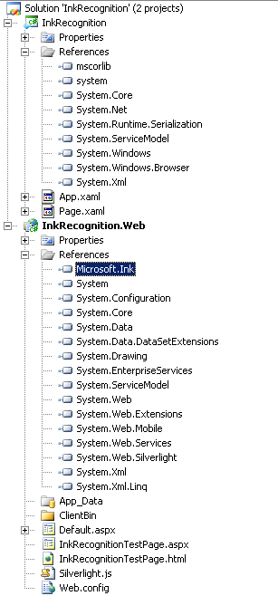
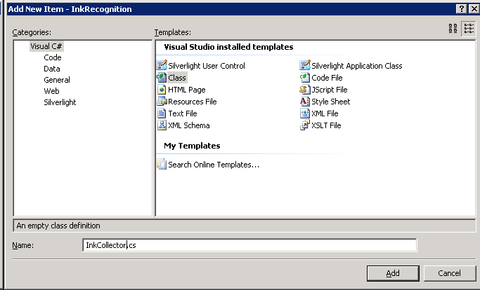
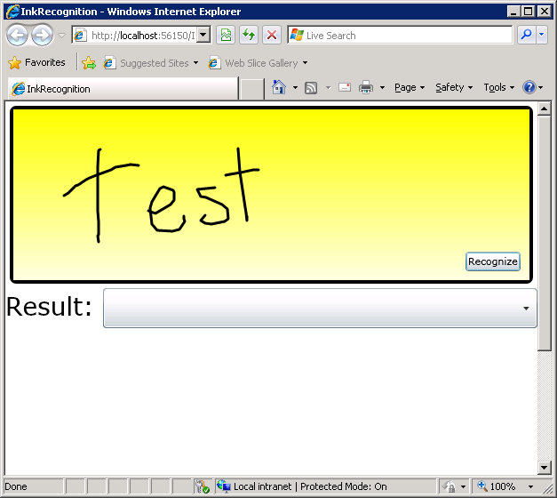
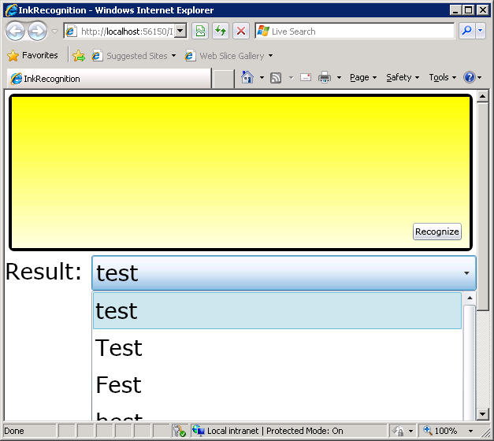

# Handwriting Recognition in Windows Server 2008 R2

Windows Server 2008 R2 supports server-side handwriting recognition. Server-side recognition lets a server recognize content from pen input on Web pages. This is particularly useful when users on a network will be specifying terms that are interpreted using a custom dictionary. For example, if you had a medical application that queried a server database for patient names, those names could be added to another database that would be cross-referenced when performing searches from a handwritten Silverlight form.

## Set up your Server for Server-Side Recognition

The following steps should be followed to set up server-side recognition.

- Install Ink and Handwriting Services
- Install Support for Web Server (IIS) and Application Server
- Enable the Desktop Experience Role
- Start the Tablet PC Input Service

### Install Ink and Handwriting Services

To install Ink and Handwriting services, open the server manager by clicking the server manager icon from the Quick Launch tray. From the **Features** menu, click **Add Features**. Make sure that you select the **Ink and Handwriting Services** check box. The following image shows the **Select Features** dialog box with **Ink and Handwriting Services** selected.

<br/>
*Select features dialog box with ink and handwriting services check box selected*

### Installation Support for Web Server (IIS) and Application Server

Open the server manager as you did for the first step. Next, you will need to add the Web Server (IIS) and Application Server roles. From the **Roles** menu, click **Add Roles**. The Add Roles wizard appears. Click **Next**. Make sure **Application Server** and **Web Server (IIS)** are selected. The following image shows the **Select Server Roles** dialog box with the **Web Server (IIS)** and **Application Server** roles selected.

<br/>
*Select server roles dialog box with web server (iis) and application server roles selected*

When you select **Application Server**, you will be asked to install the ASP.NET framework. Click the **Add the Required Features** button. After you click **Next**, you will be presented with an overview dialog box; click **Next**. The **Select Role Services** dialog box should now be available. Make sure that **Web Server (IIS)** is selected. The following image shows the **Select Role Services** dialog box with Web Server (IIS) enabled.

<br/>
*Select role services dialog box with web server (iis) enabled*

Click **Next**. An overview dialog box appears; click **Next** again. You will now be presented with a page offering you options for roles for Web Server (IIS). Click **Next**. On the next page, the **Install** button will become active. Click **Install** and you will install support for Web Server (IIS) and Application Server.

### Enable the Desktop Experience Role

To enable the desktop experience, click **Start**, click **Administrative Tools**, and then click **Server Manager**. Select **Add Services** and then select the **Desktop Experience** service. The following image shows the **Select Features** dialog box with the Desktop Experience item installed.

<br/>
*Select features dialog box with desktop experience service selected*

Click **Next** to install the Desktop Experience.

### Start the Tablet Service

After you have installed the Desktop Experience service, the Tablet PC Input service will appear in the **Services** menu. To access the **Services** menu, click **Start**, click **Administrative Tools**, and then click **Services**. To start the service, right-click **Tablet PC Input Service** and then click **Start**. The following image shows the **Services** menu with the Tablet PC Input Service started.

<br/>
*Services menu with the tablet pc input service started*

## Performing Server-Side Recognition Using Silverlight

This section shows how to create a Web application that uses Silverlight to capture handwriting input. Use the following steps to program the recognizer in Visual Studio 2008.

- Install and update Visual Studio 2008 to add support for Silverlight.
- Create a new Silverlight project in Visual Studio 2008.
- Add the necessary service references to your project.
- Create a Silverlight WCF Service for ink recognition.
- Add the service reference to your client project.
- Add the InkCollector class to the InkRecognition project.
- Remove secure transport directives from the client configuration

### Install and Update Visual Studio 2008 to Add Support for Silverlight

Before you begin, you must perform the following steps on your Windows Server 2008 R2 server.

- Install Visual Studio 2008.
- Install [Microsoft Visual Studio 2008 Service Pack 1](https://www.microsoft.com/download/details.aspx?id=10986).
- Install [Microsoft Silverlight 5 SDK](https://www.microsoft.com/silverlight/).

After you have installed these applications and updates, you are ready to create your server-side recognition Web application.

### Create a new Silverlight Web Project in Visual Studio 2008

From the **File** menu, click **New Project**. Select the Silverlight Application template from the Visual C\# project list. Name your project InkRecognition and click **OK**. The following image shows the C\# Silverlight project selected and named InkRecognition.

<br/>
*c\# silverlight project selected, with the name inkrecognition*

After you click **OK**, a dialog box prompts you to add a Silverlight application to your project. Select **Add a new ASP.NET Web project to the solution to host Silverlight** and click **OK**. The following image shows how to set up the example project before you click **OK**.

<br/>
*Dialog box with prompt for adding a silverlight application to a project*

### Add the Necessary Service References to your Project

Now you have your generic Silverlight client project (InkRecognition) with a Web project (InkRecognition.Web) set up in your solution. The project will open with Page.xaml and Default.aspx open. Close these windows and add the System.Runtime.Serialization and System.ServiceModel references to the InkRecognition project by right-clicking on the references folder in the InkRecognition project and selecting **Add Reference**. The following image shows the dialog box with the requisite references selected.

<br/>
*Add references dialog box with system.runtime.serialization and system.servicemodel selected*

Next, you need to add the System.ServiceModel and Microsoft.Ink references to the InkRecognition.Web project. The Microsoft.Ink reference will not appear in the .NET references by default, so search your Windows folder for Microsoft.Ink.dll. After you have located the DLL, add the assembly to the project references: select the **Browse** tab, change to the folder containing Microsoft.Ink.dll, select Microsoft.Ink.dll, and then click **OK**. The following image shows the project's solution in Windows Explorer with all of the reference assemblies added.

<br/>
*inkrecognition project in windows explorer with all reference assemblies added*

### Create a Silverlight WCF Service for Ink Recognition

Next, you will add a WCF service for ink recognition to the project. Right-click your InkRecognition.Web project, click **Add**, and then click **New Item**. Select the WCF Silverlight Service template, change the name to InkRecogitionService, and then click **Add**. The following image shows the **Add New Item** dialog box with the Silverlight WCF service selected and named.

<br/>
*Add new item dialog box with silverlight wcf service selected and named*

After you add the WCF Silverlight service, the service code behind, InkRecognitionService.cs, will open. Replace the service code with the following code.

```CSharp
using System;
using System.Linq;
using System.Runtime.Serialization;
using System.ServiceModel;
using System.ServiceModel.Activation;
using System.Collections.Generic;
using System.Text;
using Microsoft.Ink;

namespace InkRecognition.Web
{
    [ServiceContract(Namespace = "")]
    [AspNetCompatibilityRequirements(RequirementsMode = AspNetCompatibilityRequirementsMode.Allowed)]
    public class InkRecognitionService
    {
        [OperationContract]
        public string[] Recognize(int[][] packets)
        {
            // Deserialize ink.
            Ink ink = new Ink();
            Tablet tablet = new Tablets().DefaultTablet;
            TabletPropertyDescriptionCollection desc = new TabletPropertyDescriptionCollection();
            desc.Add(new TabletPropertyDescription(PacketProperty.X, tablet.GetPropertyMetrics(PacketProperty.X)));
            desc.Add(new TabletPropertyDescription(PacketProperty.Y, tablet.GetPropertyMetrics(PacketProperty.Y)));
            int numOfStrokes = packets.GetUpperBound(0) + 1;
            for (int i = 0; i < numOfStrokes; i++)
            {
                ink.CreateStroke(packets[i], desc);
            }

            // Recognize ink.
            RecognitionStatus recoStatus;
            RecognizerContext recoContext = new RecognizerContext();
            recoContext.RecognitionFlags = RecognitionModes.LineMode | RecognitionModes.TopInkBreaksOnly;
            recoContext.Strokes = ink.Strokes;
            RecognitionResult recoResult = recoContext.Recognize(out recoStatus);
            RecognitionAlternates alternates = recoResult.GetAlternatesFromSelection();
            string[] results = new string[alternates.Count];
            for (int i = 0; i < alternates.Count; i++)
            {
                results[i] = alternates[i].ToString();
            }

            // Send results to client.
            return results;
        }
    }
}
```

### Add the Service Reference to your Client Project

Now that you have your Silverlight WCF service for InkRecognition, you will consume the service from your client application. Right-click the InkRecognition project and select **Add Service Reference**. From the **Add Service Reference** dialog box that appears, select **Discover** to discover services from the current solution. InkRecognitionService will appear in the Services pane. Double-click InkRecognitionService from the Services pane, change the namespace to InkRecognitionServiceReference, and then click **OK**. The following image shows the **Add Service Reference** dialog box with InkRecognitionService selected and the namespace changed.

<br/>
*Add service reference dialog box with inkrecognitionservice selected and namespace changed*

### Add the InkCollector Class to the InkRecognition Project

Right-click the InkRecognition project, click **Add**, and then click **New Item**. From the **Visual C\#** menu, select **C\# class**. Name the class InkCollector. The following image shows the dialog box with the C\# class selected and named.

<br/>
*Add new item dialog box with c\# class selected and named*

After you add the InkCollector class, the class definition will open. Replace the code in the Ink Collector with the following code.

```CSharp
using System;
using System.Net;
using System.Windows;
using System.Windows.Controls;
using System.Windows.Documents;
using System.Windows.Ink;
using System.Windows.Input;
using System.Windows.Media;
using System.Windows.Media.Animation;
using System.Windows.Shapes;

namespace InkRecognition
{
    public class InkCollector : IDisposable
    {
        public InkCollector(InkPresenter presenter)
        {
            _presenter = presenter;
            _presenter.Cursor = Cursors.Stylus;
            _presenter.MouseLeftButtonDown += new MouseButtonEventHandler(_presenter_MouseLeftButtonDown);
            _presenter.MouseMove += new MouseEventHandler(_presenter_MouseMove);
            _presenter.MouseLeftButtonUp += new MouseButtonEventHandler(_presenter_MouseLeftButtonUp);
        }

        void _presenter_MouseLeftButtonDown(object sender, MouseButtonEventArgs e)
        {
            _presenter.CaptureMouse();
            if (!e.StylusDevice.Inverted)
            {
                _presenter.Cursor = Cursors.Stylus;
                _stroke = new Stroke(e.StylusDevice.GetStylusPoints(_presenter));
                _stroke.DrawingAttributes = _drawingAttributes;
                _presenter.Strokes.Add(_stroke);
            }
            else
            {
                _presenter.Cursor = Cursors.Eraser;
                _erasePoints = e.StylusDevice.GetStylusPoints(_presenter);
            }
        }

        void _presenter_MouseMove(object sender, MouseEventArgs e)
        {
            if (!e.StylusDevice.Inverted)
            {
                _presenter.Cursor = Cursors.Stylus;
            }
            else
            {
                _presenter.Cursor = Cursors.Eraser;
            }
            if (_stroke != null)
            {
                _stroke.StylusPoints.Add(e.StylusDevice.GetStylusPoints(_presenter));
            }
            else if (_erasePoints != null)
            {
                _erasePoints.Add(e.StylusDevice.GetStylusPoints(_presenter));
                StrokeCollection hitStrokes = _presenter.Strokes.HitTest(_erasePoints);
                if (hitStrokes.Count > 0)
                {
                    foreach (Stroke hitStroke in hitStrokes)
                    {
                        _presenter.Strokes.Remove(hitStroke);
                    }
                }
            }
        }

        void _presenter_MouseLeftButtonUp(object sender, MouseButtonEventArgs e)
        {
            _presenter.ReleaseMouseCapture();
            if (_stroke != null)
            {
                _stroke.StylusPoints.Add(e.StylusDevice.GetStylusPoints(_presenter));
            }
            _stroke = null;
            _erasePoints = null;
        }

        public DrawingAttributes DefaultDrawingAttributes
        {
            get { return _drawingAttributes; }
            set { _drawingAttributes = value; }
        }

        public void Dispose()
        {
            _presenter.MouseLeftButtonDown -= new MouseButtonEventHandler(_presenter_MouseLeftButtonDown);
            _presenter.MouseMove -= new MouseEventHandler(_presenter_MouseMove);
            _presenter.MouseLeftButtonUp -= new MouseButtonEventHandler(_presenter_MouseLeftButtonUp);
            _presenter = null;
        }

        private InkPresenter _presenter = null;
        private Stroke _stroke = null;
        private StylusPointCollection _erasePoints = null;
        private DrawingAttributes _drawingAttributes = new DrawingAttributes();
    }
}
```

### Update the XAML for the Default Page and Add a Code Behind for Handwriting Recognition

Now that you have a class that collects ink, you will need to update the XAML in page.xaml with the following XAML. The following code adds a yellow gradient to the input area, an InkCanvas control, and a button that will trigger recognition.

```XML
<UserControl x:Class="InkRecognition.Page"
    xmlns="http://schemas.microsoft.com/winfx/2006/xaml/presentation" 
    xmlns:x="http://schemas.microsoft.com/winfx/2006/xaml">
    <Grid x:Name="LayoutRoot" Background="White">
        <Grid.RowDefinitions>
            <RowDefinition Height="Auto"/>
            <RowDefinition Height="Auto"/>
        </Grid.RowDefinitions>
        <Border Margin="5" Grid.Row="0" BorderThickness="4" BorderBrush="Black" CornerRadius="5" Height="200">
            <Grid>
                <InkPresenter x:Name="inkCanvas">
                    <InkPresenter.Background>
                        <LinearGradientBrush StartPoint="0.5,0" EndPoint="0.5,1">
                            <GradientStop Offset="0" Color="Yellow"/>
                            <GradientStop Offset="1" Color="LightYellow"/>
                        </LinearGradientBrush>
                    </InkPresenter.Background>
                </InkPresenter>
                <Button Grid.Row="0" HorizontalAlignment="Right" VerticalAlignment="Bottom" Margin="10" Content="Recognize" Click="RecoButton_Click"/>
            </Grid>
        </Border>
        <Grid Grid.Row="1">
            <Grid.ColumnDefinitions>
                <ColumnDefinition Width="Auto"/>
                <ColumnDefinition Width="*"/>
            </Grid.ColumnDefinitions>
            <TextBlock Grid.Column="0" FontSize="28" Text="Result: "/>
            <ComboBox x:Name="results" Grid.Column="1" FontSize="28"/>
        </Grid>
    </Grid>
</UserControl>
```

Replace the code behind page, Page.xaml.cs, with the following code that will add an event handler for the **Recognize** button.

```CSharp
using System;
using System.Collections.Generic;
using System.Collections.ObjectModel;
using System.Linq;
using System.Net;
using System.Windows;
using System.Windows.Controls;
using System.Windows.Ink;
using System.Windows.Input;
using System.Windows.Media;
using System.Windows.Media.Animation;
using System.Windows.Shapes;
using InkRecognition.InkRecognitionServiceReference;

namespace InkRecognition
{
    public partial class Page : UserControl
    {
        public Page()
        {
            InitializeComponent();
            inkCol = new InkCollector(inkCanvas);
            recoClient = new InkRecognitionServiceClient();
            recoClient.RecognizeCompleted += new EventHandler<RecognizeCompletedEventArgs>(recoClient_RecognizeCompleted);
        }

        private void RecoButton_Click(object sender, RoutedEventArgs e)
        {
            // Serialize the ink into an array on ints.
            ObservableCollection<ObservableCollection<int>> packets = new ObservableCollection<ObservableCollection<int>>();
            double pixelToHimetricMultiplier = 2540d / 96d;

            foreach (Stroke stroke in inkCanvas.Strokes)
            {
                packets.Add(new ObservableCollection<int>());
                int index = inkCanvas.Strokes.IndexOf(stroke);
                for (int i = 0; i < stroke.StylusPoints.Count; i += 2)
                {
                    packets[index].Add(Convert.ToInt32(stroke.StylusPoints[i].X * pixelToHimetricMultiplier));
                    packets[index].Add(Convert.ToInt32(stroke.StylusPoints[i].Y * pixelToHimetricMultiplier));
                }
            }

            // Call the Web service.
            recoClient.RecognizeAsync(packets);
        }

        void recoClient_RecognizeCompleted(object sender, RecognizeCompletedEventArgs e)
        {
            // We have received results from the server, now display them.
            results.ItemsSource = e.Result;
            UpdateLayout();
            results.SelectedIndex = 0;
            inkCanvas.Strokes.Clear();
        }

        private InkRecognitionServiceClient recoClient = null;
        private InkCollector inkCol = null;
    }
}
```

### Remove Secure Transport Directives from the Client Configuration

Before you can consume the WCF service, you must remove all secure transport options from the service configuration because secure transports are not currently supported in Silverlight 2.0 WCF services. From the InkRecognition project, update the security settings in ServiceReferences.ClientConfig. Change the security XML from

```XML
          <security mode="None">
            <transport>
              <extendedProtectionPolicy policyEnforcement="WhenSupported" />
            </transport>
          </security>
```

to

```XML
       <security mode="None"/>
```

Now, your application should run. The following image shows how the application looks within awebpagewith some handwriting entered into the recognition box.

<br/>
*Application within awebpagewith some handwriting entered into recognition box*

The following image shows the recognized text in the **Result** drop-down list.

<br/>
*Application within awebpagewith recognized text in result drop-down list*

 

 


